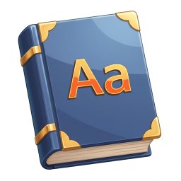
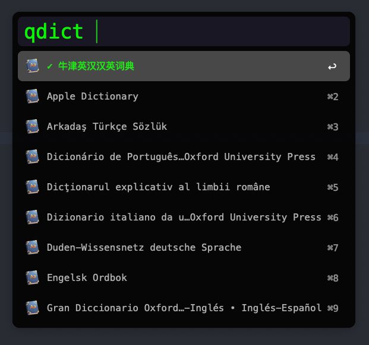
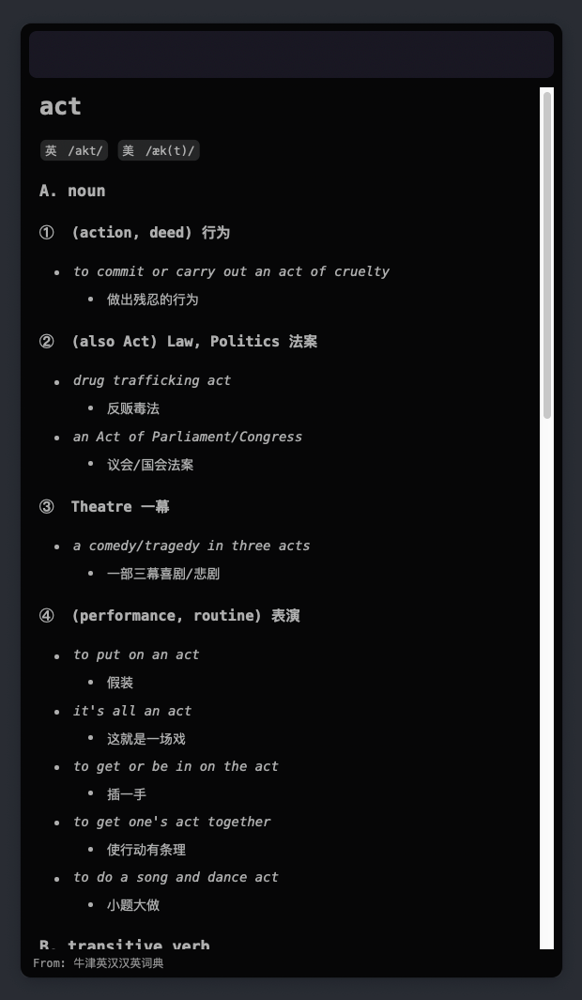

# Quick Dictionary

  

Quick Dictionary is an Alfred Workflow for quickly querying dictionaries. It is based on macOS's built-in Dictionary application.

## Features
- Supported Dictionaries
  - [x] 牛津英汉汉英词典
  

    
TODO

    
    - [ ] Apple Dictionary
    - [ ] Arkadaş Türkçe Sözlük
    - [ ] Dicionário de Português licenciado para Oxford University Press
    - [ ] Dicţionarul explicativ al limbii române
    - [ ] Dizionario italiano da un affiliato di Oxford University Press
    - [ ] Duden-Wissensnetz deutsche Sprache
    - [ ] Engelsk Ordbok
    - [ ] Gran Diccionario Oxford - Español-Inglés • Inglés-Español
    - [ ] Hrvatski Enciklopedijski Rječnik
    - [ ] Kamus Dwibahasa Melayu/Inggeris - English/Malay Bilingual Dictionary, Oxford Fajar
    - [ ] Kamus Komprehensif Bahasa Melayu - Malay Monolingual Dictionary, Oxford Fajar
    - [ ] Larousse Editorial Diccionari Manual de la llengua catalana
    - [ ] Larousse Editorial Diccionario General de la Lengua Española
    - [ ] MOT sanakirja suomi-englanti, englanti-suomi
    - [ ] Magay Tamás szótár - Magyar-Angol • Angol-Magyar
    - [ ] Multidictionnaire de la langue française
    - [ ] NE Nationalencyklopedin AB Professional English-Swedish / Svensk-Engelska
    - [ ] NE Ordbok
    - [ ] New Oxford American Dictionary
    - [ ] Norsk Ordbok
    - [ ] Oxford American Writer’s Thesaurus
    - [ ] Oxford Arabic Dictionary - عربي-إنجليزي • إنجليزي-عربي
    - [ ] Oxford Bengali Dictionaries - বাংলা-ইংরেজি • ইংরেজি-বাংলা
    - [ ] Oxford Dictionary of English
    - [ ] Oxford German Dictionary
    - [ ] Oxford Gujarati Dictionaries - ગુજરાતી-અંગ્રેજી • અંગ્રેજી-ગુજરાતી
    - [ ] Oxford Hindi Dictionaries - हिन्दी-अंग्रेज़ी • अंग्रेज़ी-हिन्दी
    - [ ] Oxford Kannada Dictionaries - ಇಂಗ್ಲಿಷ್-ಕನ್ನಡ • ಕನ್ನಡ-ಇಂಗ್ಲಿಷ್
    - [ ] Oxford Malayalam Dictionaries - മലയാളം-ഇംഗ്ലീഷ് • ഇംഗ്ലീഷ്-മലയാളം
    - [ ] Oxford PWN Polish-English Dictionary / Wielki słownik polsko-angielski
    - [ ] Oxford Paravia Il Dizionario inglese - italiano/italiano - inglese
    - [ ] Oxford Portuguese Dictionary - Português-Inglês • Inglês-Português
    - [ ] Oxford Punjabi Dictionaries - ਪੰਜਾਬੀ ਅੰਗਰੇਜ਼ੀ ਕੋਸ਼ • پنجابی انگریزی لغت
    - [ ] Oxford Russian Dictionary - Русско-Английский • Англо-Русский
    - [ ] Oxford Study Indonesian Dictionary - Inggris-Indonesia • Indonesia-Inggris
    - [ ] Oxford Tamil Dictionaries - தமிழ்-ஆங்கிலம் • ஆங்கிலம்-தமிழ்
    - [ ] Oxford Telugu Dictionaries - తెలుగు-ఇంగ్లీష్ • ఇంగ్లీష్-తెలుగు
    - [ ] Oxford Thesaurus of English
    - [ ] Oxford Turkish Dictionary - Türkçe-İngilizce • İngilizce-Türkçe
    - [ ] Oxford Urdu Dictionaries - اردو۔انگریزی • انگریزی-اردو
    - [ ] Oxford-Hachette French Dictionary
    - [ ] PONS Großwörterbuch Französisch Deutsch
    - [ ] Politikens Nudansk Ordbog
    - [ ] Praktický Anglicko-Chorvatský Slovník
    - [ ] Praktisk Engelsk-Dansk Ordbog
    - [ ] Prisma Handwoordenboek Engels
    - [ ] Prisma woordenboek Nederlands
    - [ ] Stavropoulos Oxford Greek-English Learners Dictionary
    - [ ] TTY Dictionary
    - [ ] Từ điển Lạc Việt
    - [ ] Uniwersalny słownik języka polskiego
    - [ ] Velký anglicko-český a česko-anglický slovník
    - [ ] Veľký Anglicko-Slovenský Slovník
    - [ ] Λεξικό της κοινής νεοελληνικής
    - [ ] Оксфорд Қазақ Cөздігі
    - [ ] Толковый словарь русского языка
    - [ ] Тълковен речник на съвременния български език
    - [ ] Українсько-Англійський Словник
    - [ ] מילון אבן-שושן מחודש ומותאם לשנות האלפיים
    - [ ] राजपाल हिन्दी शब्दकोश
    - [ ] พจนานุกรมอังกฤษ-ไทย \u0026 ไทย-อังกฤษ ฉบับทันสมัยและสมบูรณ์ที่สุด
    - [ ] พจนานุกรมไทย ฉบับทันสมัยและสมบูรณ์
    - [ ] ウィズダム英和辞典 / ウィズダム和英辞典
    - [ ] スーパー大辞林
    - [ ] 五南國語活用辭典
    - [ ] 商務新詞典（全新版）
    - [ ] 汉语成语词典
    - [ ] 漢英對照成語詞典
    - [ ] 牛津粵英雙語詞典
    - [ ] 现代汉语同义词典
    - [ ] 现代汉语规范词典
    - [ ] 维基百科
    - [ ] 英譯廣東口語詞典
    - [ ] 譯典通英漢雙向字典
    - [ ] 超級クラウン中日辞典 / クラウン日中辞典
    - [ ] 뉴에이스 국어사전
    - [ ] 뉴에이스 영한사전 / 뉴에이스 한영사전
  

## Installation
1. Download the latest release from GitHub.
2. Double-click the `QuickDictionary.alfredworkflow` file to install.
   
## Usage
### Setting up Dictionaries
1. Type "qdict " to display all available dictionaries. You can also type keywords to filter. (牛津英汉汉英词典 is selected by default.)
2. Use arrow keys to select a dictionary, then press Enter to confirm.

### Querying Dictionaries
1. Default shortcut: <kbd>Ctrl</kbd> + <kbd>Cmd</kbd> + <kbd>K</kbd>
2. Type the word you want to look up and press Enter.

